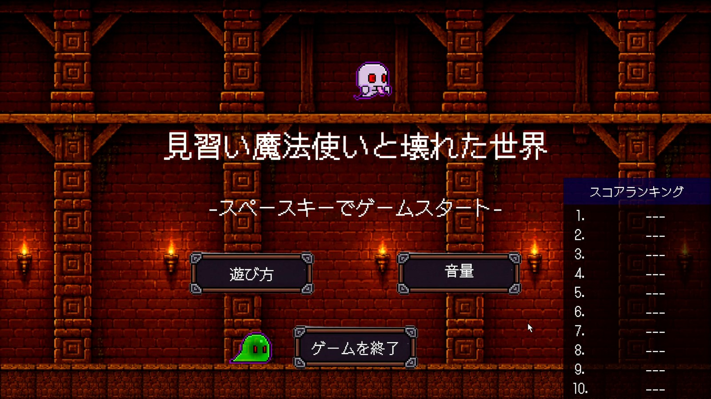
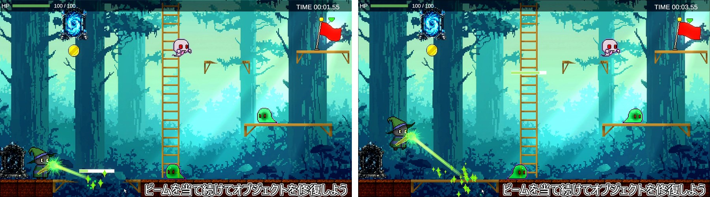
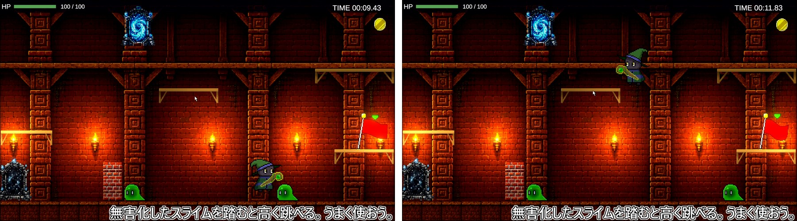
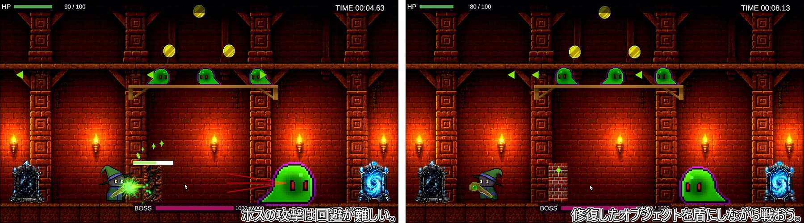

# 見習い魔法使いと壊れた世界

敵を倒す代わりに、壊れた足場や敵を「なおす」ビームで道を切り開いていく 2D 横スクロールアクションです。
CEREC GAME JAM 2026 で 4 人チーム・5 日間で制作しました。

- プレイ（ブラウザ）: https://unityroom.com/games/wizard-broken-world
- プレイ動画: https://drive.google.com/file/d/1UElqLrwro4LgA7Cv47VjyFb0QLlAULfH/view?usp=sharing
- エンジン / 言語: Unity 6 (6000.3) / C#、Universal Render Pipeline (2D)、Input System

## どんなゲームか

主人公の見習い魔法使いが放つのは修復のビームです。壊れた足場や橋、はしごに当てると通れるようになり、敵に当てると浄化されて攻撃をやめます。
ただし、同時に直した状態を保てるのは 2 つまでで、3 つ目を直すと最も古いものが崩れます。敵の弾も直した物を壊しに来るため、どれを直し、どれを諦めるかを選びながら進みます。

| 足場をなおす | 浄化したスライムを足場に使う | ボス戦 |
|---|---|---|
|  |  |  |

## 操作

| 入力 | 動作 |
|---|---|
| A / D（← / →） | 移動 |
| W / S（↑ / ↓） | はしごの昇り降り |
| Space | ジャンプ |
| マウス | 照準（左ボタンを押している間ビーム） |
| Esc | ポーズ |

## 担当

4 人チームでの共同制作です。私（[sasa618](https://github.com/sasa618)）の担当は次の 3 つです。

- プレイヤーのビーム
- 敵の挙動
- ライトの制御

## コードの見どころ

- [Assets/Scripts/Beam/RepairBeamScript.cs](Assets/Scripts/Beam/RepairBeamScript.cs)
  ビームはレイキャストで当たった相手から `IRepairable` を探して修復量を渡すだけで、相手が地形か敵かを区別しません。
  狙いの基準点をプレイヤーの中心軸に置き、向きを反転しても角度が跳ねないようにしました。
- [Assets/Scripts/Repair/IRepairable.cs](Assets/Scripts/Repair/IRepairable.cs) / [Assets/Scripts/Enemy/EnemyRepairable.cs](Assets/Scripts/Enemy/EnemyRepairable.cs)
  地形の修復と敵の浄化を同じインターフェースで受け、浄化後に起きることは `UnityEvent` で敵ごとに差し替えます。
- [Assets/Scripts/Enemy/EnemyBase.cs](Assets/Scripts/Enemy/EnemyBase.cs)
  巡回・攻撃・浄化済みの状態と、弾の発射、視界の判定をまとめた基本クラスです。各敵は毎フレームの行動と視界の形だけを差し替えます。
- [Assets/Scripts/Enemy/GhostEnemy.cs](Assets/Scripts/Enemy/GhostEnemy.cs)
  距離・角度・遮蔽の 3 条件で発見を判定する扇形の視界と、浄化時に昇りながら消える演出です。
- [Assets/Scripts/Enemy/SlimeEnemy.cs](Assets/Scripts/Enemy/SlimeEnemy.cs)
  動くかどうか、気付く距離、弾の間隔などを Inspector から変えられるようにし、検知範囲を Gizmos で表示します。

## このリポジトリに含めていないもの

再配布できない素材は含めていません。そのため、このままでは Unity で開いてもビルドは通りません。コードを読んでいただくための公開です。

- BGM・効果音の音源ファイル（出典は [Assets/Audio/BGM_credit.txt](Assets/Audio/BGM_credit.txt)）
- セーブ用アセット Quick Save（Unity Asset Store）
- セーブデータの暗号化に使うパスワード（`DataManager.cs` 内の値は伏せ字に置き換えています）

## クレジット

- BGM: 魔王魂、DOVA-SYNDROME、なぐもりず
- フォント: DotGothic16（SIL Open Font License）
- 制作: CEREC GAME JAM 2026 Team 4
